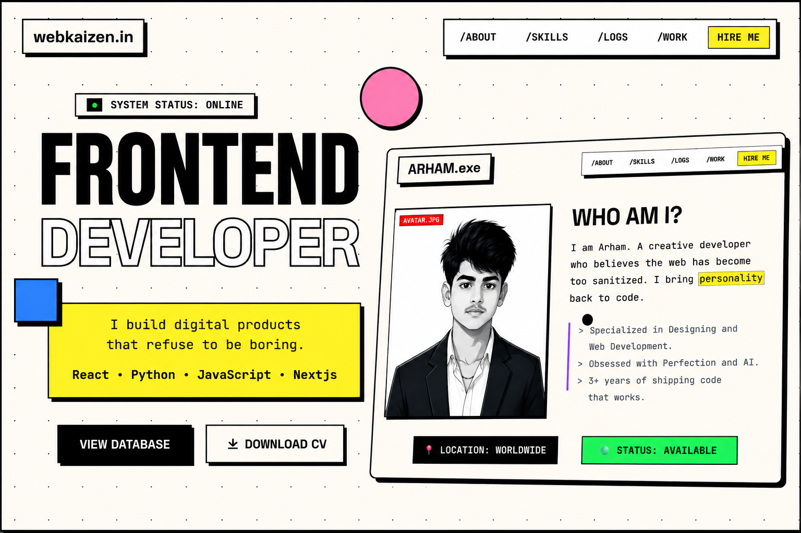

# PRINCEKUMAR-DEV74 | PORTFOLIO_V2

<p align="center">
  <a href="https://prince-portfolio-v2s.vercel.app/" target="_blank">
    
  </a>
</p>

```
██████╗  ██████╗ ██████╗ ████████╗███████╗ ██████╗ ██╗    ██╗ ██████╗
██╔══██╗██╔═══██╗██╔══██╗╚══██╔══╝██╔════╝██╔═══██╗██║    ██║██╔═══██╗
██████╔╝██║   ██║██████╔╝   ██║   █████╗  ██║   ██║██║    ██║██║   ██║
██╔═══╝ ██║   ██║██╔══██╗   ██║   ██╔══╝  ██║   ██║██║    ██║██║   ██║
██║     ╚██████╔╝██║  ██║   ██║   ██║     ╚██████╔╝███████╗██║╚██████╔╝
╚═╝      ╚═════╝ ╚═╝  ╚═╝   ╚═╝   ╚═╝      ╚═════╝ ╚══════╝╚═╝ ╚═════╝

>> SYSTEM_STATUS: ONLINE
>> VERSION: PORTFOLIO-V2

```

<p align="center">
    
    
</p>

> **WARNING**: This project is intended solely for personal use. Commercial use, reproduction, or redistribution is not permitted.

---


## ╰┈➤ TECH_STACK

| COMPONENT | TECHNOLOGY | STATUS |
| :--- | :--- | :--- |
| **CORE** | `HTML5` | [OPTIMIZED] |
| **STYLING** | `TailwindCSS` | [LOADED] |
| **SCRIPTING** | `Vanilla JS` | [ACTIVE] |
| **APIs** | `GitHub API` | [STREAMING] |
| **ICONS** | `Remix Icons` | [LINKED] |
| **FONTS** | `Space Grotesk` + `JetBrains Mono` | [IMPORTED] |

---

## ╰┈➤ FEATURES_LOG

### 01. RETRO_PORTFOLIO
> A retro-inspired frontend portfolio featuring responsive design, smooth animations, interactive UI, and clean navigation.

### 02. PURE_HTML_CSS_JS
> Built entirely with HTML, CSS, and JavaScript for a fast, lightweight, and framework-free experience.

### 03. CUSTOM_CURSOR & CUSTOM SCROLLER
> A custom-built cursor that reacts to interactive elements.
> - **Normal State**: Small Transparent crosshair/dot.
> - **Hover State**: Expands to a Neo-Yellow block with black borders.

---

## ╰┈➤ FILE_STRUCTURE

```bash
.
├── Assets/
│   ├── images/
│   ├── Resume/    
│   ├── app.js    
│   └── app.css 
├── index.html          
└── README.md            
```

---

## ╰┈➤ CONNECT

<p align="center">
  <a href="https://webkaizen.in">
    
  </a>
  <a href="https://github.com/princekumar-dev74">
    
  </a>
  <a href="https://www.youtube.com/@YOUR_CHANNEL">
    
  </a>
  <a href="https://instagram.com/webkaizen">
    
  </a>
</p>

---

## ╰┈➤ CONTACT

**TRANSMISSION OPEN:**
- **MAIL**: `sprince05873@gmail.com`
- **GITHUB**: `princekumar-dev74`

---
**© 2026 PRINCE**
